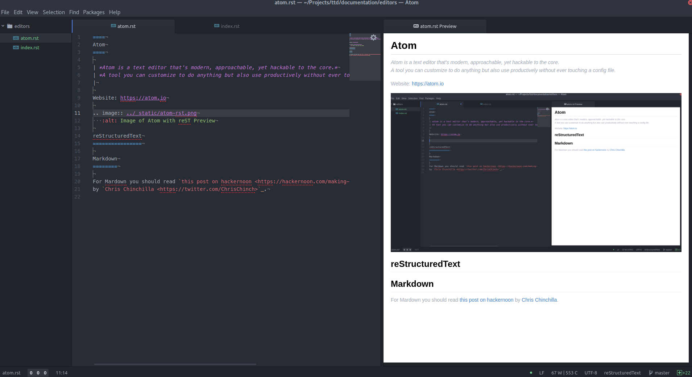

====
Atom
====

| *Atom is a text editor that's modern, approachable, yet hackable to the core.*
| *A tool you can customize to do anything but also use productively without ever touching a config file.*
|

Website: https://atom.io

reStructuredText
================

Add-ons
-------

- `highlight-line <https://atom.io/packages/highlight-line>`_
- `language-restructuredtext <https://atom.io/packages/language-restructuredtext>`_
- `line-count <https://atom.io/packages/line-count>`_
- `line-length-break <https://atom.io/packages/line-length-break>`_
- `linter <https://atom.io/packages/linter>`_
- `linter-write-good <https://atom.io/packages/linter-write-good>`_
- `minimap <https://atom.io/packages/minimap>`_
- `pigments <https://atom.io/packages/pigments>`_
- `rst-preview-pandoc <https://atom.io/packages/rst-preview-pandoc>`_
- `wordcount <https://atom.io/packages/wordcount>`_

Spell-check
-----------

Atom does not spell-check reST out of the box, you will need to add reST to your config file.

.. code-block:: yaml

   grammars: [
     "source.asciidoc"
     "source.gfm"
     "text.git-commit"
     "text.plain"
     "text.plain.null-grammar"
     "text.restructuredtext"
   ]

